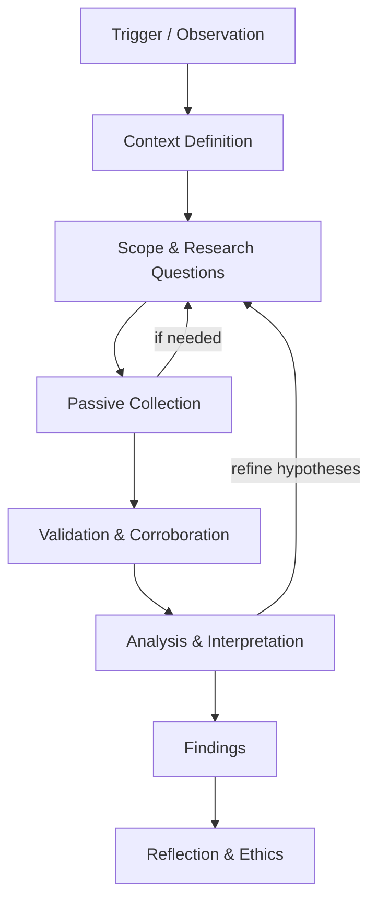

```mermaid
flowchart TD
    A[Trigger / Observation] --> B[Context Definition]
    B --> C[Scope & Research Questions]
    C --> D[Passive Collection]
    D --> E[Validation & Corroboration]
    E --> F[Analysis & Interpretation]
    F --> G[Findings]
    G --> H[Reflection & Ethics]

    D -->|if needed| C
    F -->|refine hypotheses| C
```
